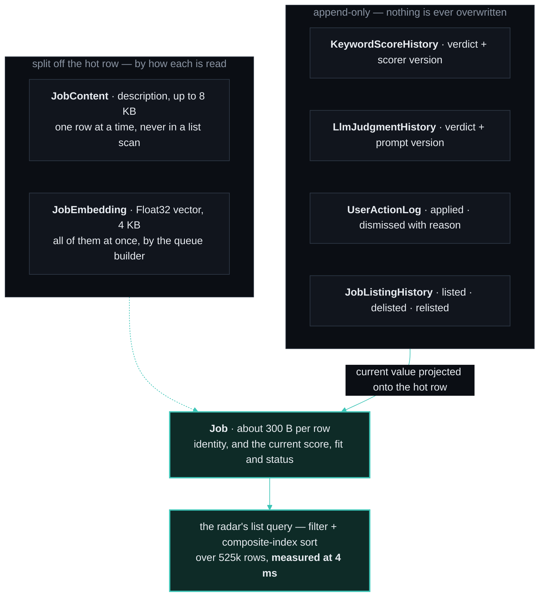

# JobRadar Architecture

> **Public copy, September 2026.** These decision records were written while JobRadar was a single-user tool on one machine. Two have since been overtaken: ADR-4 (one strong *local* judge) gave way to a hosted judge behind the same provider interface, and ADR-10/11 (one GPU, held by a run) describe a constraint the hosted design removes. They stay here because the reasoning is the point, and because the records say what was measured when. Per-user fields have since moved off the shared posting row into user-keyed tables with two staleness stamps (one for the ranking query, one for the judge's profile).

This document explains the data model and the measured decisions behind the
ranking stack. The theme throughout: **facts, derivations, and user intent are
separate layers — facts are immutable, derivations are versioned and
recomputable, user data is small and sacred.**

## The layered data model

Naming convention (it carries the semantics): `...History` = append-only,
never overwritten · `...Log` = event stream · `...Snapshot` = computed
summary, reproducible at will.

| Table | Holds | Why it exists |
|---|---|---|
| `Job` | identity, title, company, current score/fit/status projections (~300 B/row) | Every radar query runs here. The current values of score/fit/status are **cached projections** of the history tables (CQRS-lite): SQLite sorting wants the current value on the hot row. |
| `JobContent` | description (≤8 KB), content hash, cover letter | Only three consumers ever read the text (card detail, desc-fill, LLM prompts) — all row-at-a-time. List scans never touch these pages. |
| `JobEmbedding` | model tag + Float32 vector (4 KB) | Split even from content: the queue builder reads *all* vectors sequentially; a dense small table beats picking blobs out of text pages. The model tag prevents silently mixing vector spaces. |
| `JobListingHistory` | listed / delisted / relisted events | Freshness used to be overwritten in place, destroying the repost trail — which is exactly the ghost-posting signal. Events are written on state changes only, not every sweep. |
| `KeywordScoreHistory` | every scorer verdict + `scorerVersion` | A re-score is now "fill where version < current", and "what did v4 wrongly kill" is a query. |
| `LlmJudgmentHistory` | every LLM verdict + model + `promptVersion` | When the 27B overwrote the 8B's score in place, the calibration data (see ADR-3) was lost forever. Judgments are appended, never replaced; the hot row projects the authoritative one. |
| `UserActionLog` | applied / dismissed(reason) / starred / note events | Dismissal reasons turned out to be the system's most valuable labeled data (ADR-5); overwriting `status` had been discarding history. |
| `DashboardStatsSnapshot` | ingest-end counters | The stat strip reads one row instead of group-by'ing half a million on every filter click. |

**Measured effect of the split:** the pre-split Job row averaged ~10 KB
(8 KB description + 4 KB embedding inline). Every filter click paged through
gigabytes. After the split, the main list query (filter + composite-index sort
over 525k rows) measures **4 ms**.

**Deliberate compromise:** a purist design would derive current score/status
by joining the history tables. The hot-row projections trade purity for
SQLite sort performance — documented here precisely because it's a tradeoff.

## Decision records

### ADR-1 · Store everything; flag judgment (store-all)

**Before:** postings failing the keyword gates were dropped at ingest. Every
scorer improvement raised the same unanswerable question: *what did the old
scorer wrongly kill?* Answering meant re-crawling ~50k boards.

**After:** every fetched posting is stored; gate-rejected ones carry
`disqualified=true` and never render. A scorer fix is a local re-score.
The flag + a partial-index-style composite keeps the archive out of the hot
query path.

**Evidence this was needed:** three manual audit rounds had found the scorer
killing German/Dutch/Polish titles (English-only role signals), real postings
(description-scoped negatives hitting recruiter boilerplate), and
"Salesforce developer" (substring "sales"). Each fix left us blind to what
else had been lost. The first store-all sweep kept 341k postings the old
pipeline would have silently discarded.

### ADR-2 · Embedding bake-off with pre-frozen queries

To decide whether semantic similarity should drive the LLM queue, 5 local
embedding models × 4 query strategies × 2 document variants were evaluated
against existing LLM fit scores (zero new LLM cost). **Query texts were
committed to git before any results existed** — tuning queries against the
test set would invalidate it, and the commit history proves the discipline.

Findings (3,077 fit-scored jobs; metric: precision@100 on a held-out split):

| Ranker | confirm p@100 |
|---|---|
| keyword score (baseline) | 0.580 |
| best embedding (qwen3-embedding:0.6b, whole-CV query) | **0.740** |
| best hypothesized strategy (hand-written facet sentences) | worst in every model |

Surprises: the smallest new-generation model won; the "obvious" facet-sentence
strategy lost to simply embedding the whole CV; the multilingual advantage
couldn't be measured (the survivor pool was English-heavy — noted as a limit,
not assumed).

### ADR-3 · Blend ranks, not scores — weight chosen by sweep

Keyword score and embedding similarity live on incompatible scales, so the
queue blends their **ranks**. A weight sweep (0→100% in 10% steps, evaluated
on tune/confirm/gold slices) showed a plateau at 30–40% keyword:

| kw% | tune p@100 | confirm | gold (27B-judged) |
|---|---|---|---|
| 0 | 0.660 | 0.730 | 0.440 |
| **40** | 0.750 | **0.730** | **0.520** |
| 100 | 0.520 | 0.580 | 0.480 |

The two signals fail differently — keyword is blind to unlisted skills
(a "C# Developer" posting scored like any generic developer), embedding
over-trusts topical similarity — and the blend beats both. Weight lives in
config, re-measured as the gold set grows. Visa-positive postings (sponsor
register / explicit sponsorship) form a strict priority tier above the blend.

### ADR-4 · One strong local judge over a cheap-triage cascade

The first design used a free-cloud/8B triage pass with a 27B review behind it.
Measured on 371 double-judged postings: the first pass ran **~29% optimistic**
— "strong" had stopped meaning anything. Decision: retire the triage tier;
the locally-run 27B judges directly (~1 job/min, fine for a weekly cadence),
stamped with model + prompt version in `LlmJudgmentHistory`. The measurement
that justified this is reproducible forever because judgments are now
append-only (ADR-3's history table) — the original one was a lucky accident
of both values briefly coexisting.

### ADR-5 · Dismissal reasons as labeled training data

Dismissing a job asks *why* (one click: language / seniority / stack /
company-applied / …). 55 reasoned dismissals surfaced four measurable gaps:
a hardcoded senior/staff title boost promoting exactly the levels the user
rejects; language walls buried mid-description sailing to fit 85; native
mobile roles passing the engineering gate; and one application at a company
costing 14 manual dismissals of its sibling postings. Each fix landed in the
layer where it stays true for other users (see below); the reasons now
accumulate in `UserActionLog` by design.

### ADR-6 · Persona-independence: detection is universal, judgment is profile

Every fix from ADR-5 obeyed one rule: **shared code may detect facts;
only the profile may judge them.** Language requirements are detected
universally (multilingual patterns, hedge-aware); whether German-required is
a *barrier* depends on `profile.languages`. Seniority levels are extracted
universally (title levels, years-of-experience, management signals); which
levels are *unwanted* is per-profile and per-track — ten years in Unity makes
"lead" welcome there while newer fields cap at senior. An iOS developer
running this codebase gets their own profile, not this user's exclusions:
user-specific role negatives ride the profile and still respect the
specific-track override (a "Unity iOS Developer" survives an "ios developer"
exclusion).

### ADR-7 · A posting is sections, not a prefix

**Before:** every consumer took the first N characters of the description.
That is a bet that postings put the important part first, and they do not: a
posting that opens with the company's founding story produced an embedding
describing the *company*, so it sat near every other posting that did the same
regardless of the role. The LLM's window was spent the same way.

**Two measurements forced the change.** First, the stored text was not text:
the old converter stripped tags *before* decoding entities, and Greenhouse —
our largest source — returns its content HTML-encoded, so the tag regex matched
nothing and the decode step then *manifested* markup into the stored text.
**47–58% of a stored Greenhouse description was ``.** Repairing
the pool removed **218.6 MB** of markup. Second, once the text was readable it
could be parsed: headings split a posting into requirements / responsibilities
/ benefits / EEO boilerplate, and **98.3% of postings expose enough structure
to split** (the rest fall back to a body classifier).

**After:** `postingView(text, consumer)` gives each consumer its own view under
its own budget, with per-kind quotas and a second top-up pass. The fit judge
gets requirements — **99.6% of requirement sections arrive whole** — and the
embedding gets what the job *is*. Nothing is deleted from storage; a view is a
projection, and a new consumer is a new quota rather than a new truncation.

**A caveat this bought the hard way:** each converter change ships a
`TEXT_VERSION` bump, and rows written by a broken converter cannot always be
repaired offline. The `t2` converter deleted everything between a decoded
`&lt;` and the next `&gt;` — "must be &lt; 100ms and uptime &gt; 99%" became
"must be 99%" — so those rows are stale *by version* and must be re-fetched.
The words are gone; only the source still has them.

### ADR-8 · Staleness is cache invalidation, not version arithmetic

**The bug:** "is this vector current?" was answered by comparing the vector's
stamp against the code's current `TEXT_VERSION`. With `TEXT_VERSION` at `t3`
and no row yet *carrying* `t3`, the predicate was unsatisfiable: **445,358
vectors that already existed were permanently stale**, re-embedding wrote a
stamp that still did not match, and the worker's idle lane — which continues
without sleeping when it finds work — re-embedded the same first 2,000 rows
forever. The GPU ran all night and the queue did not move.

Two stamp designs were tried and **both were wrong in the same way**. Stamping
the code's version lied (a vector built from an old description claimed to be
current); stamping the row's own version and comparing it to the constant made
the question unanswerable. The error was treating currency as *arithmetic over
two rows' version strings*.

**After:** it is cache invalidation, and the writer performs it. Everything
that rewrites a description — ingest, `desc:fill`, `repair-descriptions` —
clears the vector's stamp in the same transaction. Staleness became a
single-row test, and the stamp records only *which projection* built the
vector, which is the one thing no other row can know.

The generalisation: **a version comparison is only meaningful when both sides
are guaranteed to exist.** Cross-row version arithmetic quietly assumes a
backfill has already run. Write-time invalidation assumes nothing.

### ADR-9 · Disclose the risk; do not hide the posting

The radar had an age filter — *fresh / recent / all* — defaulting to fresh.
It was hiding **a third of the pool**: 53,905 postings visible, 78,715 in
reality. Worse, the postings it hid were the ones the system knew the most
about, since ghost-risk and staleness are *derived* signals with real error
bars, and a filter converts an uncertain signal into a certain absence.

**After:** the filter is gone. A posting whose claimed date is old carries a
*may not be fresh* badge under its score; one the judge flagged carries *ghost
risk*. Both stay in the ranking. This costs a little screen space and buys two
things: the user decides in a second with the evidence in front of them, and a
wrong signal becomes *visible* — a mislabelled posting can be seen and fixed,
where a wrongly hidden one is invisible by construction. The same reasoning
already governed store-all (ADR-1); this applies it to the view layer.

The version-stamp view got the same treatment rather than a re-judge: a score
from an older prompt renders **faded** instead of being hidden or silently
presented as current.

### ADR-10 · One GPU, one holder, chunked bands

Judging is the bottleneck — a 27B model reads ~1 posting/minute — and the
constraint that shapes everything is that **the judge (17.7 GB) and the
embedder (0.6 GB) do not fit in a 6 GB card together.** Alternating them per
job meant the runtime spent most of its wall clock swapping weights, and the
memory pressure produced outright spawn failures (`0xC0000142`) once the judge
spilled into system RAM.

**Design:** a file lock with a heartbeat, held for a whole *phase* rather than
a job, plus a delegation flag so a child process inherits its parent's hold
instead of deadlocking against it. Any other process — a manual script, an
ingest — reports who holds the GPU and waits.

> **Superseded in part by ADR-11.** The phase-length hold and the file stand.
> "One holder" and the delegation flag do not: identifying the holder by process
> id, and delegating with a flag that named no particular hold, produced
> twenty-eight defects across five review rounds. The queue shape below is
> untouched.

**Queue shape:** bands by score (≥80, then ≥70, …) worked in **chunks of
~1,000** rather than band-at-a-time, so the first hour produces the postings a
user would actually read first instead of a complete pass over a band whose end
they may never reach. A chunk boundary never splits a score value — otherwise
which side of the boundary a posting lands on depends on row order, which is
not a property of the posting. Visa-marked postings form a strict lane above
all of it, and they bypass the freshness filter: a sponsor-registered employer
is worth judging even on an older posting, because the *company* fact outlives
the vacancy.

Everything is resumable from what the database already holds, because the
alternative — a queue in memory — loses an hour of GPU to any interruption.

### ADR-11 · The GPU is held by a run, not by a process

ADR-10 framed the lock as a way to stop the runtime thrashing between models.
Measured on the machine this runs on, it is more than that: 31.8 GB of RAM with
roughly 4 GB free under a dev server and a browser, and llama-server holding
most of the 17.7 GB judge resident. A second model does not slow the machine
down, it **takes it down**. The lock is a crash guard.

That reframing decides everything else, because it makes the errors asymmetric.
Holding the card when you did not need it costs throughput. Believing you hold
it when you do not costs the machine. So: **when the state of the card is
uncertain, do not work.**

**What went wrong under "one holder".** The holder was a process id, and every
assumption built on that turned out to be false. The worker cannot see the pid
that does the work — it spawns through a `tsx` wrapper which re-spawns, so the
pid it records loads no model (measured: parent 31116, script 29748). Two
processes wrote one field with two meanings, so one could erase the other's
claim permanently. Nothing checked that a process attaching to the lock had any
relationship to its holder, so an orphan could sign a lock a different worker
had legitimately taken. And a pid is a number the OS hands back out, so a
restarted worker drawing a recycled one was indistinguishable from the worker
that died.

Five rounds of review found twenty-eight defects here and the count did not
fall — 5, 4, 6, 7, 6 — because each round's worst finding was a defect in the
previous round's fix. They were one unanswered question surfacing in a new place
each time.

**Design:** a **run** holds the card. It is created when the card is taken,
carries an identity generated at that moment, and ends when the last
**participant** leaves. Processes take part in a run; they do not own it. A
process id answers exactly one question — is this participant still alive — and
never says which run this is or who may join it. The identity travels to a
spawned process through the environment, so joining is a question with an
answer: *is this the run I was handed?*

**Two rules about time, and only one of them is a clock.** A run with no living
participant is over at once, whatever its heartbeat says — that is what makes a
restart instant, instead of waiting out a timer for a process that no longer
exists. A run with a living participant is **never** taken, however long it has
been silent, because that process may still have the model resident and taking
the card from it is precisely the crash. The heartbeat survives only as an
eight-hour backstop against a recycled pid making a dead run look alive forever;
it is longer than any legitimate run and is not a limit on how long work may
take.

**Consequences.** A hung run holds the card until a human ends it, and the busy
message names the process to end. Ollama used outside JobRadar is invisible to
this and can still crash the machine — a real gap, deliberately out of scope,
since the lock could only withdraw our own work rather than prevent another
process's load.

**Amended (2026-08-25), closing the two questions the first review left open:**

- **Creation is exclusive.** Taking the card was a read then a write, so two
  processes could both see it free, both write, and both believe they had
  acquired — the loser working on uncovered while warning into a log nobody
  reads mid-run. Runs are now created with an exclusive write (`wx`): exactly
  one create lands, the loser re-reads and is told the truth. Updates stay on
  the atomic-replace path — those races are between participants of the same
  run, and re-entry on every beat already heals them.
- **A run is stamped with its boot.** A pid only means anything on the boot
  that issued it. A crash leaves the file behind; the OS reissues low numbers
  quickly after a restart; a listed pid landing on an innocent system process
  held the card for the whole backstop, with the busy message pointing the
  reader at that innocent process. A run stamped by a previous boot is now over
  before liveness is even asked. Runs written before the stamp keep the old
  rules.
- **The lock lives outside anything synced.** The old default, `data/gpu.lock`,
  sat inside a OneDrive folder — and a lock whose correctness rests on
  millisecond renames does not belong under a sync engine's open handles. The
  default is now under `LOCALAPPDATA`; `JOBRADAR_GPU_LOCK` still overrides.

**Testing.** Two seams. The module's own interface covers the rules. A second,
narrow seam spawns real processes through the same wrapper the worker uses,
because four of the five review rounds found their worst defect in the gap
*between* processes — a gap the in-process seam cannot see, and which fixtures
inventing a pid actively hid.

### ADR-12 · The pursuit lifecycle defines effects, not permissions

The rules that read pursuit statuses had one tested home (`pool.ts`); the
rules that produce them had none. One policy — nudge 10 days after applying,
a concluded pursuit needs no nudge, suggest ghosted after 14 more days of
silence — lived as constants and branches in three files, one of them a render
function, with zero tests on the write side. Its one invariant was enforced
only on read: dismissing left the follow-up date behind and `/applied`
compensated with a status guard.

**Decision: one module owns every consequence of a status change, and it
validates nothing.** Any status may follow any status. This is deliberate and
was re-examined under a product lens, since a state-machine validator is the
textbook move here: the tool is local-first, so even as a product each user
remains the authority over their own pursuit data, and `applied → new` is
almost always an undo, not an error. Rejecting it fights the user. The
asymmetry seals it — adding validation later is one function at the seam this
module creates; removing it later breaks users' habits. If a real API surface
ever exists, legality belongs at that boundary, not in the domain effects.

**The price of no permissions is total effects.** Every jump must mean
something, including the ones a single-user tool never sees: a pursuit tracked
late enters at interview or offer with no applied stamp, and under the old
partial rules the follow-up machinery simply never engaged for it. So:
entering any tracked status stamps `appliedAt` if unset — including a pursuit
recorded only at its rejection; the follow-up date is born with that stamp,
dies at definitive ends (concluded, dismissed), and is otherwise the user's to
keep, a deliberate clear included; dismissing records the reason (ADR-5's
data), leaving dismissal clears it.

The nudge rule was amended the same day it shipped, by review: the first
version filled every missing follow-up date on entering an awaiting status,
and `null` carries two meanings there — "never scheduled" and "the user
pressed no-nudge". Filling both re-armed an explicit opt-out and let an
undo round-trip silently defer the date. One field, two meanings: the same
disease ADR-11 treated in the GPU lock's `child` field.

## Evolution note

The system did not start with this architecture, deliberately: a single fat
table shipped the first 480k postings and produced the findings above. The
layered model was adopted the day the measurements demanded it (filter
latency, lost calibration data, unanswerable audit questions), migrated by an
idempotent SQL script in 31 seconds with the old projections seeded as
`pre-migration` history rows. Starting with event-sourcing on day one would
have been architecture cosplay; adopting it against evidence is the point.
