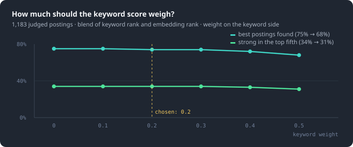

# Measurements

Every ranking layer was chosen by a measurement against a frozen ground truth. Six of them, each as question · finding · decision. Small samples give direction, not rates; the text says which is which. The raw records stay private; the numbers are as measured.

## 1 · Reasoning effort, temperature, ceiling

**Question.** GLM-5.3-Flash offers `low` / `high` / `max`. Which, and at what output ceiling?

| effort | ceiling | postings | what happened |
|---|---|---|---|
| low | 3,000 → 8,000 | 74 | bimodal: 223 vs 4,328 reasoning tokens on the same posting; mis-read requirement lists both ways |
| **high** | **8,000** | **133** | the full run; every later comparison is against it |
| max | 12,000 | 108 | 86% same verdicts as high, 97% same gates, ~3× output tokens, missed one location gate |

**Finding that changed the prompt.** At `high`, 20 postings × 3 identical runs: **13 of 20 changed verdict**, every flip through a *count* (a borderline requirement counted or not).

**Decision.** `high`, temperature 0, ceiling 8,000 — and stop asking the model to count.

## 2 · The ledger prompt (v8.5 → v8.6.3)

**Question.** Does a per-requirement ledger make the verdict stable and explainable?

**Finding.** Gates first (work authorization, language, location), then the role's identity in a sentence, then a ledger: each requirement direct / adjacent / none with evidence, the ramp small / substantial; the code computes 0-100 and the verdict threshold. Two parser bugs surfaced on the way — a "nice-to-have" section dropped in 12 of 133 postings — and were fixed: 12 → 1 → 0. A version that weighted an identity paragraph lowered every score; the paragraph stayed, its weight went.

**Decision.** v8.6.3, frozen; a stratified 1,183-posting set judged with it is the ground truth below. Cost: **0.1-0.2 cents per posting**, ~48% prefix-cache hits with two concurrent streams (6 of 133 with one).

## 3 · Embeddings: the query decides, not the model

**Question.** Which embedding model, and what to embed on the query side?

**Finding.** Short adverts written from the CV beat the raw CV on every model tried — precision at 100: **0.46 vs 0.30**. Similarity is the *maximum* over the adverts, not the mean, so a three-role CV does not bury its best-fitting specialised postings. A 1,500- and a 2,500-character posting window measured the same.

**Decision.** Qwen3-Embedding-0.6B; adverts generated at profile time; raw CV as fallback.

## 4 · The keyword / embedding blend

**Question.** How much ranking should the keyword score keep once the embedding is good?

**Finding.** Strong in the top fifth: 34 / 34 / 34 / 34 / 33 / 31 % at weights 0 to 0.5; best postings found: 75 / 75 / 74 / 74 / 72 / 68 %. Flat to 0.3, a cost after. An earlier sweep with the raw-CV query had chosen 0.4; a better query left the keyword score little to add.

**Decision.** 0.2 — not zero, because a posting with no vector yet still needs a rank.

## 5 · Storing the ranking key

**Question.** The blend was measured on ranks, which cannot be stored. Does an absolute stored score reproduce them?

**Finding.** On the ground truth, Spearman 0.987-0.990 against the rank blend, one to two points of precision lost; on the live pool of 102,619 postings, 0.97 with 87% of the top 100 shared.

**Decision.** Store similarity and an absolute blend; the blend is null until a vector exists.

## 6 · Hosted embedding

**Question.** Can the embedding leave the laptop?

**Finding.** The same checkpoint is served at $0.01 per million tokens: **about fifty cents per hundred thousand postings**. Vector-space compatibility with the local model is the next measurement.

---

Not here, on purpose: posting texts, the CV behind the ground truth, per-posting records. Personal or third-party data; the measurements are the point.

## Coverage, as counted on 2026-09-07

The numbers the README's first screen uses, with where each comes from. They are counts, not measurements of quality, and they move daily; the README is updated at each version, not at each count.

| what | count | source |
|---|---|---|
| postings in the database | 575,859 | the Job table; nothing is deleted, delisted postings stay with a date |
| of which live under the region gate | 93,279 | not delisted, not region-disqualified (a further ~184,000 from the US, Canada, India and Australia are in the database but gated) |
| company boards discovered and probed live | 61,804 | the discovery registry |
| applicant-tracking platforms read first-hand | 30 | one adapter each |
| board and aggregator connectors | 53 | one adapter each |
| public sponsor registers matched by employer name | 6 | NL, GB, DK, IE, PT, CZ |
| unit tests | 630 | Node's test runner, 2026-09-08 |
