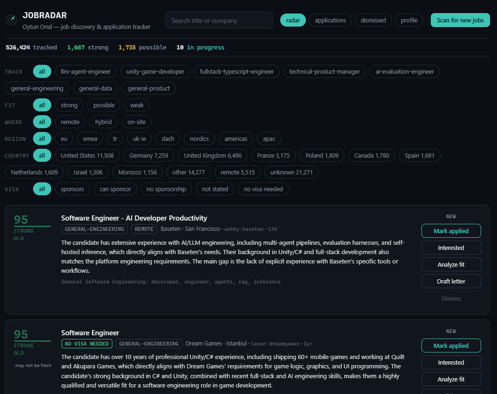
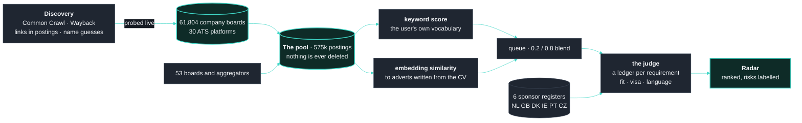
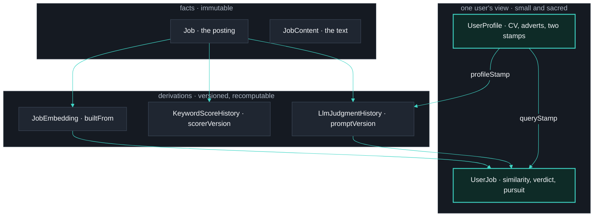

  

  Reads employers' own hiring boards first-hand, judges every posting against a CV, 
  and answers three questions per posting: <b>does it fit, will they sponsor a visa, is the language requirement real.</b>

  <a href="MEASUREMENTS.md"><b>Measurements</b></a> &nbsp;·&nbsp;
  <a href="ARCHITECTURE.md"><b>Architecture and decision records</b></a>

---

> The public face of a private project: the engineering, not the code. The code stays private while the tool becomes a hosted product; parts of it are shared on request.

## How it works

Three scores per posting, each measured before it was trusted: a **keyword score** (deterministic, free), an **embedding similarity** to short adverts generated from the CV (the query text, not the model, decided ranking quality), and a **judge** that fills a per-requirement ledger from which the score is computed rather than asked for. Visa answers come from six governments' sponsor registers, matched by employer name.

## Five decisions

| | The decision | What forced it |
|---|---|---|
| 1 | **Measure, then decide.** Model, query text, blend weight, reasoning effort, temperature, ceiling: each chosen against a frozen ground truth; the losers are kept. | A "reasonable default" cost a week twice. [Measurements](MEASUREMENTS.md) |
| 2 | **The judge writes a ledger; the code writes the score.** | Asking for a number flipped 13 of 20 verdicts across identical runs. |
| 3 | **Facts, derivations and intent are separate layers.** Every derived value carries the version of what made it; "refresh" is "fill where the version is behind". | Overwriting in place destroyed the calibration data once. [ADR-8](ARCHITECTURE.md#adr-8--staleness-is-cache-invalidation-not-version-arithmetic) |
| 4 | **Risks are labelled, never hidden.** | A hidden posting teaches nothing; a wrong filter is invisible. [ADR-9](ARCHITECTURE.md#adr-9--disclose-the-risk-do-not-hide-the-posting) |
| 5 | **A text-level guard for the bug the type checker cannot see.** | Six writers kept writing moved fields and `tsc` passed every one. |

## The data model, in one picture

Facts never change. Derivations carry the version of what produced them. A user's data is small, keyed to the user, and stamped twice: an advert edit re-ranks the pool in seconds; a CV edit says how many verdicts go stale and what re-judging costs before it moves. The radar's list query over half a million rows measures 4 ms. [Full records →](ARCHITECTURE.md)

## Where it is going

Since September 2026 the tool is being redesigned as a hosted product for cross-border job seekers: a free tier that searches the pool, paid plans that buy a daily budget of judged postings. Same discipline: an evidence-graded inventory, grounded research, a one-pager that survived an adversarial review, and a plan whose first slice is a kill test, not a build.

**Stack.** TypeScript · Next.js · Prisma · SQLite → Postgres · Node's test runner (618 tests) · a seven-provider LLM chain behind one interface · Qwen3-Embedding.

**Author.** Oytun Önal. The decisions and the measurements are the portfolio; ask for the code.
